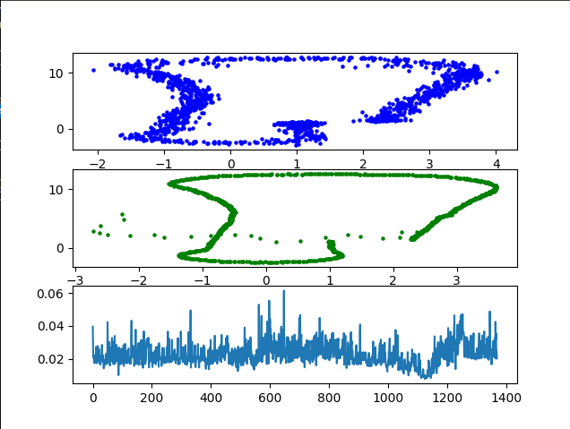
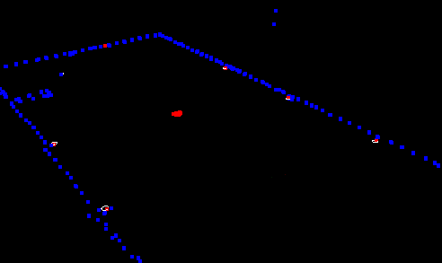

# Particle Filter Assignment report
Report sul lavoro svolto nell'assignment riguardante il Particle Filter.

## Stato dell'opera
21/11/2023 - 23:40
Attualmente la simulazione presenta un problema con la localizzazione del veicolo. Dalla simulazione quello che noto è che perdo la localizzazione del veicolo ad un instante preciso, (45esimo), quando viene introdotto un nuovo landmark alla mappa. Nei prossimi giorni proveró a fixxare questo problema così da avere una implementazione di PF funzionante, anche se non vale piú per l'assignment ma per scopo didattico.

21/11/2023 - 00:09
Trovata una possibile soluzione per ovviare il problema del falso landmark, aggiornata la nuova configurazione migliore.


### Configuraione migliore ottenuta
Di seguito indico la migliore configuraione che ho usato per le varie simulazioni per ottenere il risultato migliore.
``` c++
#define NPARTICLES 200
...
double sigma_init [3] = {0.1, 0.1, 0.1};  //[x,y,theta] initialization noise. 
double sigma_pos [3]  = {0.25, 0.25, 0.25}; //[x,y,theta] movement noise. Try values between [0.5 and 0.01]
double sigma_landmark [2] = {0.3, 0.3};     //[x,y] sensor measurement noise. Try values between [0.5 and 0.1]
```


## Problema con i Landmark
Un primo problema riscontrato nella simulazione è nei Landmark. Infatti nel corso della simulazione, ad un particolare instante di tempo, all'incirca il 45esimo, sembra che viene associata una osservazione ad un landmark non presente nella mappa. Ricollegandomi a quanto detto in classe, ho dedotto che questo errora sia provocato dalla televisione presente nel garage che ha le proprietà di riflettere i raggi emessi dal sensore, simili ai landmark posizionati nel garage.
(Notare il puntino bianco nella particella blu di conrtorno della mappa.)



## Proposte di ottimizzazione del codice
Ho notato che alcuni loop possono essere paralelizzati. In particolare tutti i loop che implicano lo scorrimento delle particelle per essere aggiornate o renderizzate nel render. Un esempio proposto:
``` c++
void ParticleFilter::updateWeights(double std_landmark[],  std::vector<LandmarkObs> observations, Map map_landmarks) {
    //Creates a vector that stores tha map
    // ...
    #pragma omp parallel for schedule(dynamic, 1)
    for(int i=0;i<particles.size();i++){
        // Before applying the association we have to transform the observations in the global coordinates
        std::vector<LandmarkObs> transformed_observations;
        // for each observation transform it (transformation function)
        for(int j=0;j<observations.size();j++) {
            #pragma omp critical
            transformed_observations.push_back(transformation(observations[j], particles[i]));
        }

    }
}
```
La #pragma omp critical è necessaria per gestire le race condition che si creano su transformed_observations.
Ho optato per uno scheduling dinamico con una divisione dei task, molto fine grane, questo perché voglio che quando un thread si libera da un lavoro, possa subito prendere in carico una iterazione successiva del lavoro. 

Per questa proposta ci tengo a ringraziare un mio collega di corso, Antonio, che parlando mi ha introdotto questa possibilitá di paralelizzazione dei vari loop che non presentano dipendenze.

### Svantaggi della ottimizzazione
Questo ci permette di paralelizzare certi blocchi di codice e quindi migliorare la velocità di computazione e aprirci a gestiore un valore di particelle molto più alto. Però allo stesso tempo aggiunge una clomplessità nel algoritmo, in quando tutta la gestione delle race condition è lasciata la programmatore.